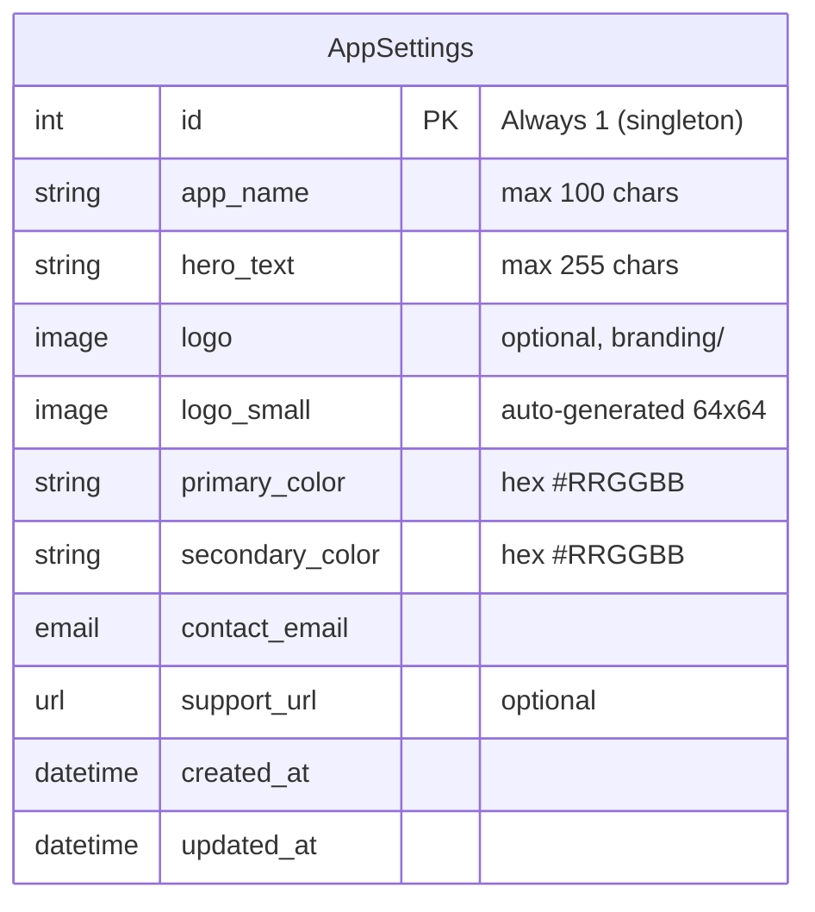
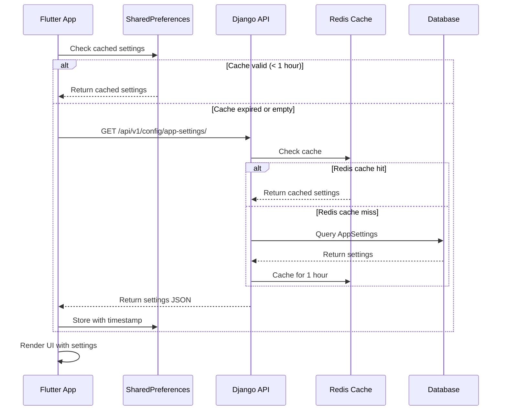
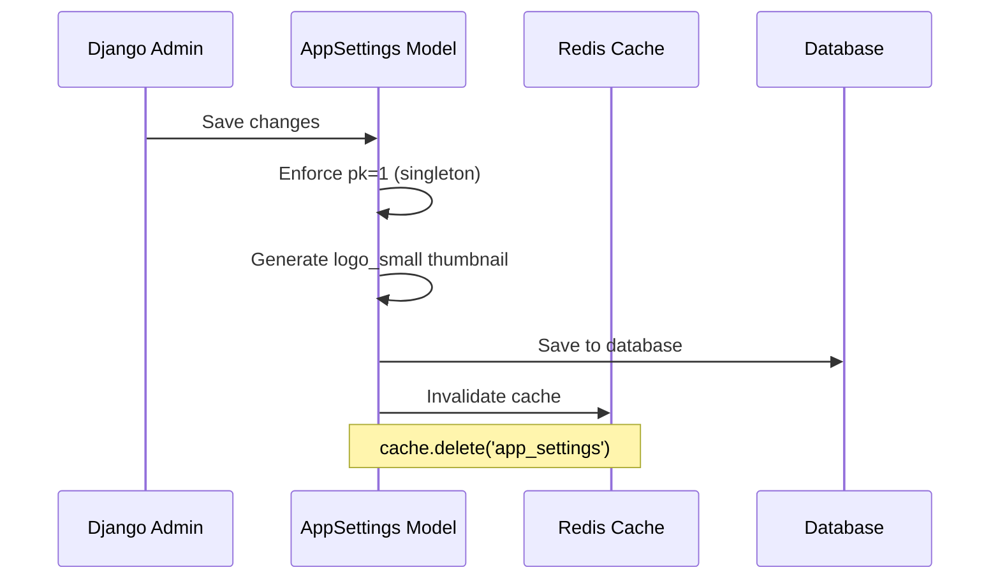

# App Branding & Configuration

## Overview

### What This Feature Solves
App Branding provides centralized management of application branding elements (logo, name, colors, contact info) through Django Admin. It eliminates hardcoded branding across templates and mobile app, enabling dynamic customization without code changes.

### Use Cases
1. **UC1: Superuser Updates Branding** - Superuser changes app name, logo, or colors via Django Admin
2. **UC2: Mobile App Loads Branding** - Flutter app fetches branding settings on startup
3. **UC3: Django Templates Render Branding** - Email and web templates use dynamic branding
4. **UC4: Offline Fallback** - Mobile app uses cached/default settings when offline

### Where Used in System
- Django Admin: AppSettings management (superuser only)
- Django Templates: 13+ templates use `{{ app_settings.* }}`
- Flutter Mobile: Home screen, drawer, MaterialApp title
- Email Templates: Headers, footers, contact info

## Architecture

### Components

#### Django Apps
- **core** - Contains AppSettings model, API endpoint, context processor

#### Key Models

| Model | File | Purpose |
|-------|------|---------|
| `AppSettings` | `apps/core/models.py:159` | Singleton model for branding configuration |

#### Services

| Service | File | Methods |
|---------|------|---------|
| `AppSettings.get_settings()` | `apps/core/models.py:235` | Cached settings retrieval with auto-creation |

#### API Endpoints

| Method | Endpoint | View | Purpose |
|--------|----------|------|---------|
| GET | `/api/v1/config/app-settings/` | `AppSettingsAPIView` | Public endpoint for branding settings |

### Data Model



### Flow Diagrams

#### Mobile App Settings Load



#### Admin Updates Branding



## Implementation Details

### Key Patterns

#### Singleton Pattern
AppSettings uses a custom singleton implementation:
- `save()` always sets `pk=1`
- `delete()` is a no-op (cannot delete)
- `get_or_create(pk=1)` ensures single instance

```python
def save(self, *args, **kwargs):
    self.pk = 1  # Enforce singleton
    # ... generate thumbnail if needed
    super().save(*args, **kwargs)
    self._invalidate_cache()

def delete(self, *args, **kwargs):
    pass  # Prevent deletion
```

#### Cache-Aside Pattern
Settings are cached in Redis with 1-hour TTL:
1. Check cache first
2. On miss, query database
3. Store result in cache
4. Invalidate cache on save

```python
@classmethod
def get_settings(cls):
    cache_key = getattr(settings, 'APP_SETTINGS_CACHE_KEY', 'app_settings')
    cached = cache.get(cache_key)
    if cached is not None:
        return cached

    obj, _ = cls.objects.get_or_create(pk=1)
    cache.set(cache_key, obj, timeout=3600)
    return obj
```

#### Thumbnail Generation
Logo thumbnails are auto-generated using Pillow:
- 64x64 maximum size
- Preserves aspect ratio
- Handles PNG (RGBA) and JPEG formats

### Database

#### Migration
`apps/core/migrations/0003_add_app_settings.py`

#### Fields
| Field | Type | Constraints |
|-------|------|-------------|
| `app_name` | CharField(100) | default='App name' |
| `hero_text` | CharField(255) | default='Your hero string' |
| `logo` | ImageField | upload_to='branding/', nullable |
| `logo_small` | ImageField | upload_to='branding/', auto-generated |
| `primary_color` | CharField(7) | hex validator, default='#667eea' |
| `secondary_color` | CharField(7) | hex validator, default='#764ba2' |
| `contact_email` | EmailField | default='support@example.com' |
| `support_url` | URLField | blank=True |

### API

#### GET /api/v1/config/app-settings/

**Permission:** Public (AllowAny)

**Response 200:**
```json
{
    "app_name": "Altea",
    "hero_text": "Break the Bad Habits",
    "logo_url": "http://localhost:8000/media/branding/logo.png",
    "logo_small_url": "http://localhost:8000/media/branding/logo_small.png",
    "logo_initial": "A",
    "primary_color": "#667eea",
    "secondary_color": "#764ba2",
    "contact_email": "support@altea.ch",
    "support_url": "https://altea.ch/support",
    "updated_at": "2025-12-07T10:30:00Z"
}
```

**Notes:**
- `logo_url` and `logo_small_url` are null if no logo uploaded
- `logo_initial` is first letter of `app_name` (uppercase)
- Absolute URLs when request context is available

### Configuration

#### Settings (`config/settings/base.py`)

```python
# Cache Configuration
CACHES = {
    'default': {
        'BACKEND': 'django_redis.cache.RedisCache',
        'LOCATION': env('REDIS_URL', default='redis://localhost:6379/0'),
        'OPTIONS': {
            'CLIENT_CLASS': 'django_redis.client.DefaultClient',
        },
        'KEY_PREFIX': 'altea',
        'TIMEOUT': 3600,
    }
}

# App Settings Cache
APP_SETTINGS_CACHE_KEY = 'app_settings'
APP_SETTINGS_CACHE_TIMEOUT = 3600  # 1 hour

# Context Processors
TEMPLATES = [{
    'OPTIONS': {
        'context_processors': [
            # ...
            'apps.core.context_processors.app_settings',
        ],
    },
}]
```

#### Environment Variables
| Variable | Default | Purpose |
|----------|---------|---------|
| `REDIS_URL` | `redis://localhost:6379/0` | Redis connection URL |

## Testing

### Coverage
- **Overall:** 82%
- **models.py:** 88%
- **admin.py:** 82%
- **context_processors.py:** 100%

### Running Tests
```bash
# All AppSettings tests (88 tests)
python3 manage.py test apps.core.tests.test_app_settings --keepdb -v 2

# With coverage report
python3 -m coverage run --source=apps.core manage.py test apps.core.tests.test_app_settings --keepdb
python3 -m coverage report -m
```

### Key Test Scenarios
| Category | Tests |
|----------|-------|
| Hex Color Validation | 8 tests |
| Singleton Pattern | 12 tests |
| Model Edge Cases | 13 tests |
| Logo Handling | 8 tests |
| API Endpoint | 11 tests |
| Serializer | 6 tests |
| Context Processor | 3 tests |
| Cache | 4 tests |
| Admin Permissions | 11 tests |
| HTTP Methods | 5 tests |
| Integration | 4 tests |

## Performance Considerations

### Caching Strategy
- **Redis cache:** 1-hour TTL on backend
- **SharedPreferences:** 1-hour TTL on Flutter
- **Cache invalidation:** On model save only

### Database Queries
- Single query per cache miss
- `get_or_create` for auto-creation
- No N+1 issues (singleton model)

### Image Processing
- Thumbnail generated on logo upload only
- Pillow operations are synchronous
- Consider async processing for large images

## Security

### Access Control
| Operation | Permission |
|-----------|------------|
| View in Admin | Superuser only |
| Edit in Admin | Superuser only |
| Add in Admin | Superuser only (if none exists) |
| Delete in Admin | Disabled |
| API GET | Public |

### Validation
- Hex color: Regex `^#[0-9A-Fa-f]{6}$`
- Email: Django EmailValidator
- URL: Django URLValidator
- Image: Pillow validates on thumbnail generation

### Potential Risks
- **Large image uploads:** Consider file size limits
- **Cache poisoning:** Redis should be secured
- **Public API:** No sensitive data exposed

## Dependencies

### Internal
- `apps.core.models.TimeStampedModel` - Base model with timestamps

### External
| Package | Version | Purpose |
|---------|---------|---------|
| `django-redis` | 5.4.0 | Redis cache backend |
| `Pillow` | (existing) | Image thumbnail generation |

## Known Limitations

### Current
- Single logo format (no SVG support)
- No image optimization (WebP conversion)
- Synchronous thumbnail generation
- No multi-tenancy support

### Future Improvements
- [ ] SVG logo support
- [ ] WebP image optimization
- [ ] Async thumbnail generation with Celery
- [ ] Multiple color schemes
- [ ] Theme presets

## File Structure

```
apps/core/
├── admin.py                    # AppSettingsAdmin (lines 68-190)
├── api/
│   ├── serializers.py          # AppSettingsSerializer (lines 77-110)
│   ├── urls.py                 # Route: config/app-settings/
│   └── views.py                # AppSettingsAPIView (lines 21-42)
├── context_processors.py       # app_settings() context processor
├── management/
│   └── commands/
│       └── seed_app_settings.py # Management command
├── migrations/
│   └── 0003_add_app_settings.py
├── models.py                   # AppSettings model (lines 159-276)
└── tests/
    └── test_app_settings.py    # 88 tests
```

## Related Documentation

- [Feature Documentation](../../../features/app-branding/README.md)
- [Mobile App Architecture](../../flutter-apps/mobile-app.md)

---

**Created**: 2025-12-07
**Last Updated**: 2025-12-07
**Version**: 1.0
**Status**: ✅ Production
