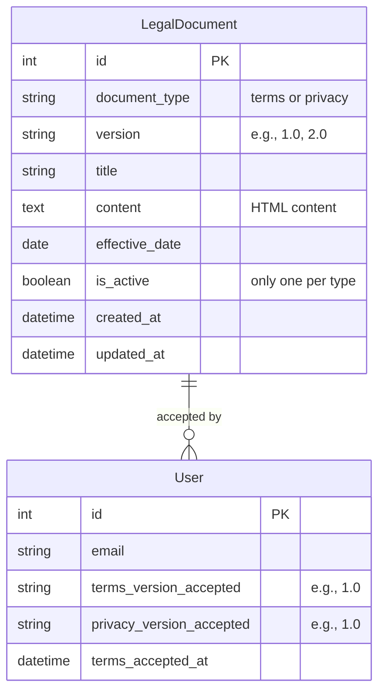
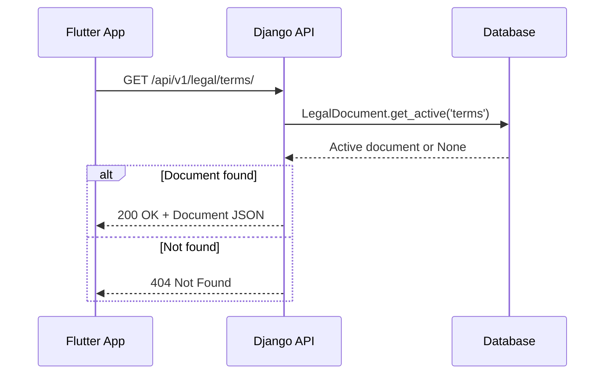
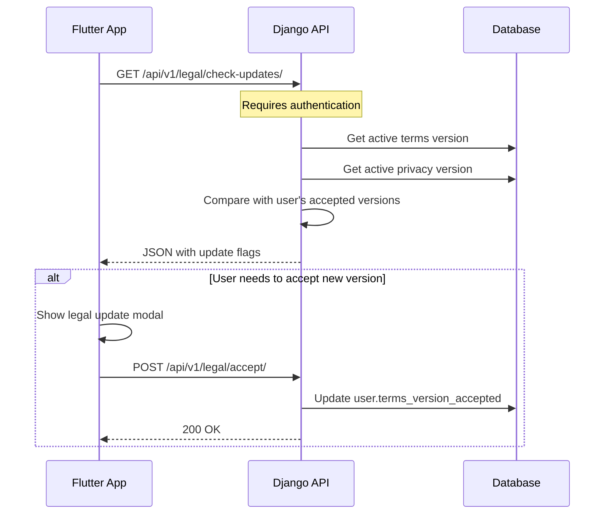
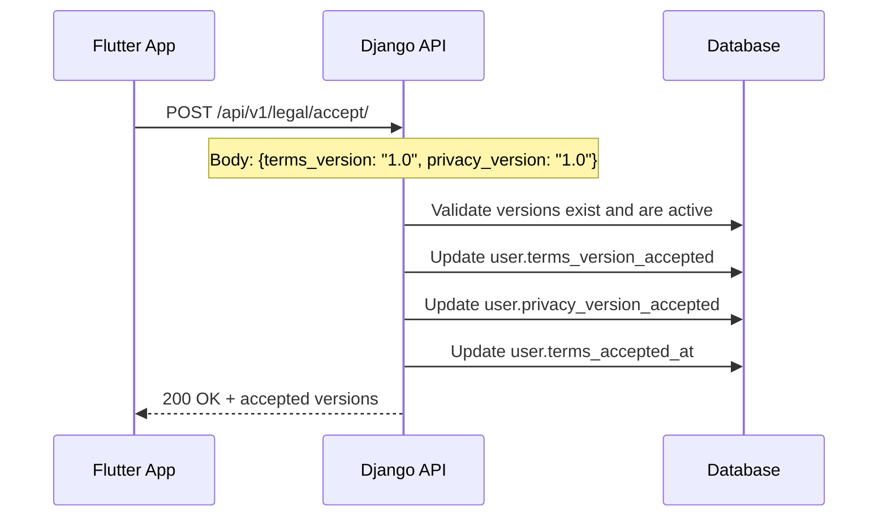
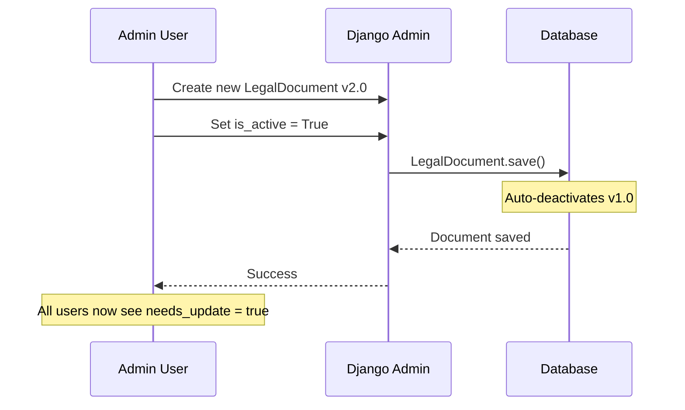

# Legal Documents

## Overview

### What This Feature Solves
Legal Documents provides versioned Terms of Service and Privacy Policy management for the Altea platform. It ensures GDPR and Swiss FADP compliance by tracking which version of legal documents each user has accepted, supporting document version updates, and requiring re-acceptance when policies change.

### Use Cases
1. **UC1: View Legal Documents** - Users can read Terms of Service and Privacy Policy before/after registration
2. **UC2: Accept Documents at Registration** - User accepts current versions during account creation
3. **UC3: Accept Updated Documents** - When documents are updated, existing users must accept new versions
4. **UC4: Check for Updates** - App checks if user needs to accept new legal document versions
5. **UC5: Admin Document Management** - Administrators create and manage versioned legal documents

### Where Used in System
- Flutter mobile app: Registration screen terms links, settings screen
- Django web: `/legal/terms/` and `/legal/privacy/` public pages
- Admin panel: Document creation and version management
- API: Check for updates, document retrieval, acceptance tracking

## Architecture

### Components

#### Django Apps
- **core** - Contains LegalDocument model and API endpoints
- **accounts** - Stores user's accepted document versions on User model

#### Key Models

| Model | File | Purpose |
|-------|------|---------|
| `LegalDocument` | `apps/core/models.py:79` | Stores versioned legal documents with HTML content |
| `User` (extended) | `apps/accounts/models.py:14` | Tracks `terms_version_accepted`, `privacy_version_accepted` |

#### Services
No dedicated service layer - simple CRUD operations handled directly in views.

#### API Endpoints

| Method | Endpoint | View | Auth | Purpose |
|--------|----------|------|------|---------|
| GET | `/api/v1/legal/` | `LegalDocumentListAPIView` | No | List active documents (without content) |
| GET | `/api/v1/legal/terms/` | `TermsOfServiceAPIView` | No | Get active Terms of Service |
| GET | `/api/v1/legal/privacy/` | `PrivacyPolicyAPIView` | No | Get active Privacy Policy |
| POST | `/api/v1/legal/accept/` | `AcceptLegalDocumentsAPIView` | Yes | Accept document versions |
| GET | `/api/v1/legal/check-updates/` | `CheckLegalUpdatesAPIView` | Yes | Check if user needs to accept updates |

#### Web Endpoints

| URL | View | Purpose |
|-----|------|---------|
| `/legal/terms/` | `TermsOfServiceView` | Public Terms of Service page |
| `/legal/privacy/` | `PrivacyPolicyView` | Public Privacy Policy page |

### Data Model



### Constraints
- `unique_together = ['document_type', 'version']` - Only one document per type+version combination
- Only one document of each type can be `is_active=True` at a time (enforced in `save()`)

## Flows

### Document Retrieval Flow



### Check Updates Flow



### Accept Documents Flow



### Admin Document Update Flow



## API Specification

### GET /api/v1/legal/

**Response 200:**
```json
[
    {
        "id": 1,
        "document_type": "terms",
        "document_type_display": "Terms of Service",
        "version": "1.0",
        "title": "Terms of Service",
        "effective_date": "2025-12-06"
    },
    {
        "id": 2,
        "document_type": "privacy",
        "document_type_display": "Privacy Policy",
        "version": "1.0",
        "title": "Privacy Policy",
        "effective_date": "2025-12-06"
    }
]
```

### GET /api/v1/legal/terms/

**Response 200:**
```json
{
    "id": 1,
    "document_type": "terms",
    "document_type_display": "Terms of Service",
    "version": "1.0",
    "title": "Terms of Service",
    "content": "<h2>1. Introduction...</h2>...",
    "effective_date": "2025-12-06"
}
```

**Response 404:**
```json
{
    "error": true,
    "message": "Terms of Service not found"
}
```

### POST /api/v1/legal/accept/

**Request:**
```json
{
    "terms_version": "1.0",
    "privacy_version": "1.0"
}
```

**Response 200:**
```json
{
    "message": "Legal documents accepted successfully",
    "terms_version_accepted": "1.0",
    "privacy_version_accepted": "1.0"
}
```

**Response 400:**
```json
{
    "terms_version": ["Terms of Service version \"2.0\" not found or not active."]
}
```

### GET /api/v1/legal/check-updates/

**Response 200:**
```json
{
    "needs_terms_update": false,
    "needs_privacy_update": false,
    "current_terms_version": "1.0",
    "current_privacy_version": "1.0",
    "user_terms_version": "1.0",
    "user_privacy_version": "1.0"
}
```

## Compliance

### Swiss FADP (DSG) Compliance
- Health data classified as sensitive personal data
- Explicit consent required for health data processing
- Data subject rights: access, rectification, erasure, portability
- FDPIC contact information provided

### GDPR Compliance
- Legal basis documented for each data type
- Data retention periods defined
- International transfer safeguards (SCCs)
- Right to withdraw consent
- Right to lodge complaint with supervisory authority

### Document Content

#### Terms of Service (18 sections)
1. Introduction and Acceptance
2. Eligibility (18+ requirement)
3. Description of Service
4. Account Registration and Security
5. User Conduct and Responsibilities
6. **Health Disclaimer** - NOT a medical device
7. Intellectual Property
8. Data Protection
9. Sharing Features
10. Service Availability and Modifications
11. Termination
12. **Limitation of Liability** (Swiss law)
13. Indemnification
14. **Governing Law** (Switzerland, Zurich)
15. Changes to Terms
16. Severability
17. Entire Agreement
18. Contact Information

#### Privacy Policy (17 sections)
1. Introduction (FADP/GDPR compliance)
2. Categories of Personal Data
3. **Legal Basis for Processing** (table)
4. How We Use Your Data
5. Data Sharing and Disclosure
6. **International Data Transfers**
7. **Data Retention** (table)
8. **Your Rights** (full list with legal references)
9. Data Security (technical measures)
10. Data Breach Notification
11. Children's Privacy
12. Automated Decision-Making
13. Cookies and Similar Technologies
14. Third-Party Links
15. Changes to This Policy
16. Swiss Representative
17. Contact Us

## Configuration

### Settings

```python
# No specific settings required
# Documents are managed via Admin panel or seed command
```

### Management Command

```bash
# Create initial legal documents
python manage.py seed_legal_documents

# Force recreate (useful for development)
python manage.py seed_legal_documents --force
```

### Startup Integration

The `start.sh` script automatically seeds legal documents:
```bash
python manage.py seed_legal_documents
```

## File Structure

```
apps/core/
├── api/
│   ├── __init__.py
│   ├── serializers.py     # LegalDocumentSerializer, AcceptLegalDocumentsSerializer
│   ├── urls.py            # API routes
│   └── views.py           # API views for legal documents
├── management/
│   └── commands/
│       └── seed_legal_documents.py  # Seed command
├── migrations/
│   └── 0001_add_legal_document.py
├── models.py              # LegalDocument model
├── urls.py                # Web routes (/legal/terms/, /legal/privacy/)
├── views.py               # Web views for legal pages
└── admin.py               # LegalDocumentAdmin

templates/legal/
├── base_legal.html        # Base template with styling
├── terms.html             # Terms of Service template
├── privacy.html           # Privacy Policy template
└── not_found.html         # 404 page for missing documents

apps/accounts/
├── models.py              # User model with version tracking fields
└── migrations/
    └── 0003_add_legal_version_fields.py

mobile/lib/
├── core/
│   └── config/env_config.dart   # termsUrl, privacyUrl
├── core/router/app_router.dart  # /terms, /privacy routes
└── presentation/screens/
    └── legal/
        ├── legal_document_screen.dart  # Base screen with url_launcher
        ├── terms_screen.dart
        └── privacy_screen.dart
```

## Admin Panel

### LegalDocumentAdmin Features
- List view: title, type, version, effective_date, status badge
- Status badges: Active (green), Inactive (gray)
- Filters: document_type, is_active, effective_date
- Auto-deactivation: Setting `is_active=True` deactivates other documents of same type

### Creating New Document Version

1. Go to Admin > Core > Legal documents
2. Click "Add Legal Document"
3. Fill in:
   - Document type: terms or privacy
   - Version: "2.0" (increment from previous)
   - Title: "Terms of Service" / "Privacy Policy"
   - Content: HTML content
   - Effective date: When the document takes effect
   - Is active: Check to make this the current version
4. Save

## Flutter Integration

### Opening Legal Documents

Legal documents are opened in the device's in-app browser using `url_launcher`:

```dart
// Opens Terms in Safari View Controller (iOS) / Chrome Custom Tabs (Android)
await launchUrl(
  Uri.parse('${EnvConfig.webBaseUrl}/legal/terms/?app=1'),
  mode: LaunchMode.inAppBrowserView,
);
```

The `?app=1` query parameter adds a "Back to App" button on the web page.

### Registration Screen Integration

```dart
RichText(
  text: TextSpan(
    children: [
      TextSpan(text: 'I agree to the '),
      TextSpan(
        text: 'Terms of Service',
        recognizer: TapGestureRecognizer()
          ..onTap = () => context.push('/terms'),
      ),
      TextSpan(text: ' and '),
      TextSpan(
        text: 'Privacy Policy',
        recognizer: TapGestureRecognizer()
          ..onTap = () => context.push('/privacy'),
      ),
    ],
  ),
)
```

## Testing

### Seed Command Testing
```bash
# Test seed command
python manage.py seed_legal_documents

# Verify documents created
python manage.py shell -c "from apps.core.models import LegalDocument; print(LegalDocument.objects.filter(is_active=True).values('document_type', 'version'))"
```

### API Testing
```bash
# Test list endpoint
curl http://localhost:8000/api/v1/legal/

# Test terms endpoint
curl http://localhost:8000/api/v1/legal/terms/

# Test check updates (requires auth)
curl -H "Authorization: Bearer <token>" http://localhost:8000/api/v1/legal/check-updates/
```

### Web Page Testing
- Visit `http://localhost:8000/legal/terms/` - Should display Terms of Service
- Visit `http://localhost:8000/legal/privacy/` - Should display Privacy Policy
- Add `?app=1` to see "Back to App" button

## Related Documentation

- [User Registration](./user-registration.md) - Registration flow that requires terms acceptance
- API Documentation: `/api/docs/` (Swagger UI)
