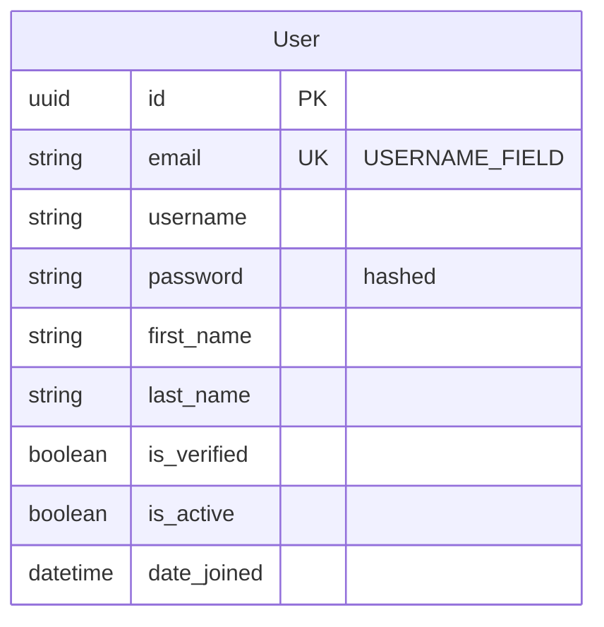
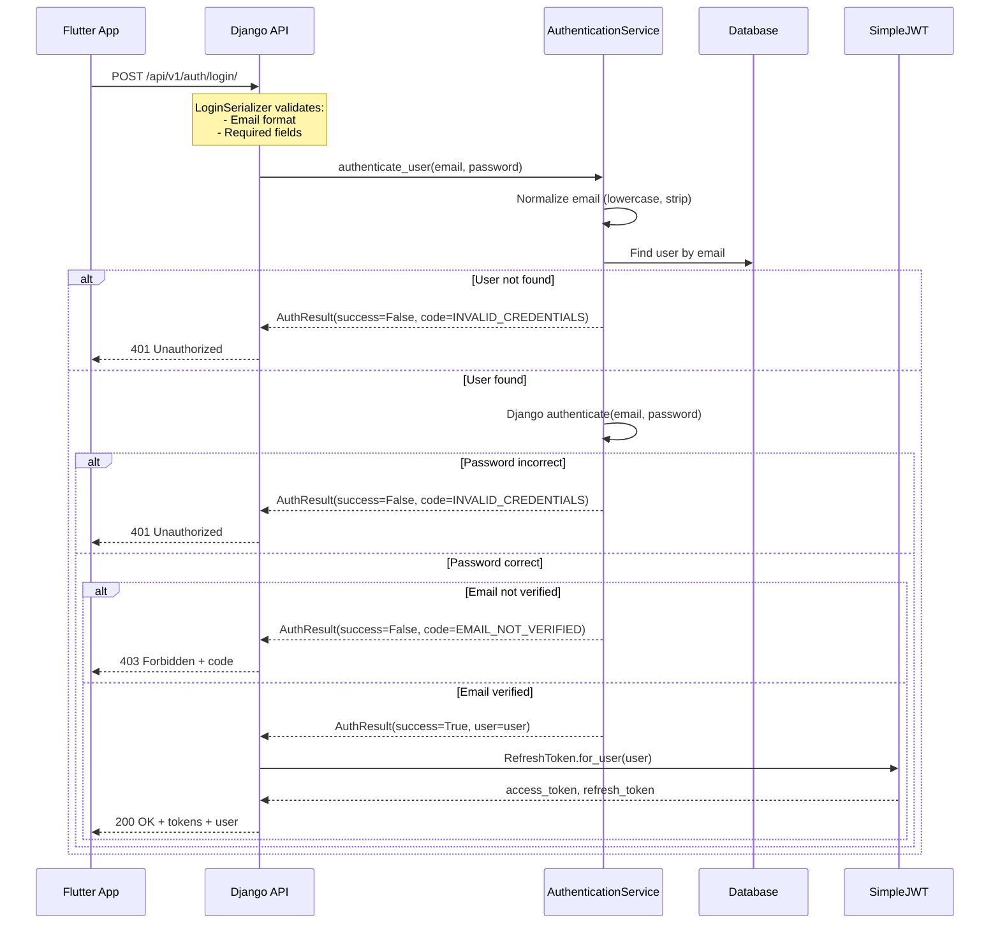
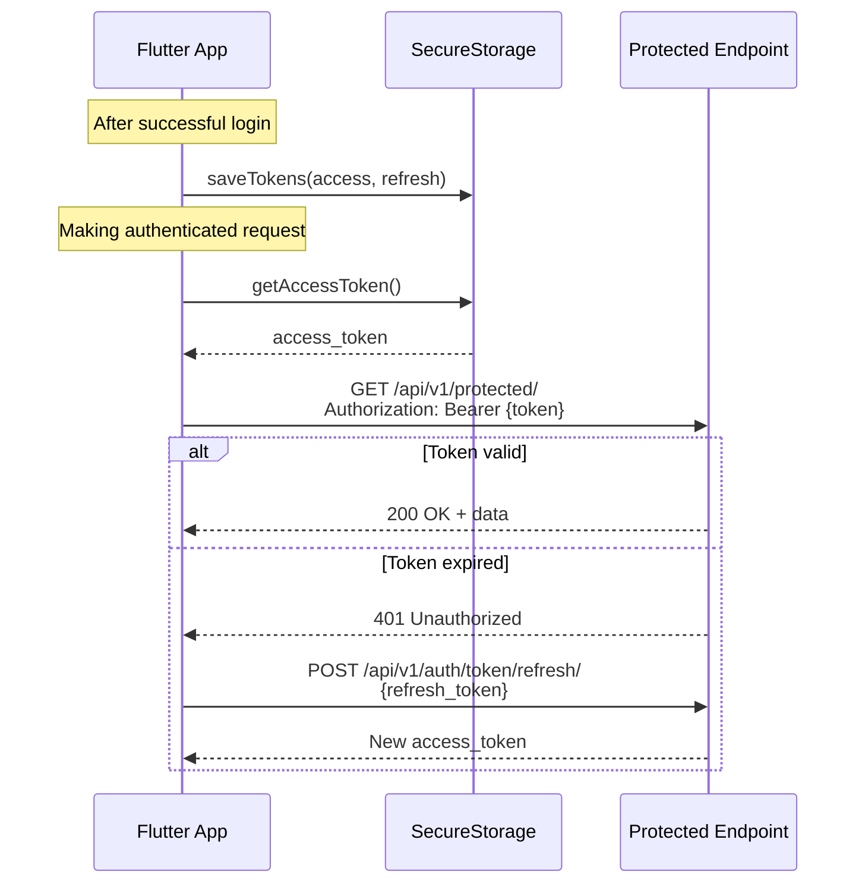

# User Login

## Overview

### What This Feature Solves
User Login provides secure JWT-based authentication for the Altea mobile application. It authenticates users with email/password credentials and returns JWT tokens for subsequent API access.

### Use Cases
1. **UC1: Successful Login** - Verified user logs in with correct credentials and receives JWT tokens
2. **UC2: Failed Login - Wrong Credentials** - User enters incorrect email or password
3. **UC3: Failed Login - Unverified Email** - User attempts to login before email verification
4. **UC4: Rate Limited** - User exceeds maximum login attempts

### Where Used in System
- Flutter mobile app: Login screen (`mobile/lib/presentation/screens/auth/login_screen.dart`)
- All authenticated API endpoints (via JWT token in Authorization header)
- Token refresh endpoint (SimpleJWT built-in)

## Architecture

### Components

#### Django Apps
- **accounts** - Core authentication app containing User model, login logic, and API endpoints
- **rest_framework_simplejwt** - JWT token generation and validation

#### Key Models

| Model | File | Purpose |
|-------|------|---------|
| `User` | `apps/accounts/models.py:14` | Extended Django AbstractUser with `is_verified` field |

#### Services

| Service | File | Methods |
|---------|------|---------|
| `AuthenticationService` | `apps/accounts/services.py:37` | `authenticate_user()` - Validates credentials and verification status |

#### Supporting Types

| Type | File | Purpose |
|------|------|---------|
| `AuthErrorCode` | `apps/accounts/services.py:22` | Enum for error codes (`INVALID_CREDENTIALS`, `EMAIL_NOT_VERIFIED`) |
| `AuthResult` | `apps/accounts/services.py:28` | Dataclass for authentication result with success/error info |

#### API Endpoints

| Method | Endpoint | View | Purpose |
|--------|----------|------|---------|
| POST | `/api/v1/auth/login/` | `LoginAPIView` | Authenticate user, return JWT tokens |

### Data Model



> **Note:** No new database tables are created for login. Uses existing `User` model from registration.

### Flow Diagrams

#### Login Flow



#### Token Usage Flow



## Implementation Details

### Key Patterns

1. **Service Layer Pattern** - Business logic in `AuthenticationService`, views are thin controllers
2. **Dataclass for Results** - `AuthResult` provides typed return values with success/error info
3. **Error Code Enum** - `AuthErrorCode` distinguishes between error types for proper HTTP status codes
4. **Custom Throttle Parser** - `LoginThrottle` extends DRF to support `5/15m` rate format

### Security Design

```python
# Same error message for "user not found" and "wrong password"
# Prevents email enumeration attacks
if not result.success:
    if result.error_code == AuthErrorCode.EMAIL_NOT_VERIFIED:
        return Response(status=403)  # Different code for unverified
    return Response({"detail": "Invalid credentials"}, status=401)
```

### API

#### Endpoints

| Method | Endpoint | Description |
|--------|----------|-------------|
| POST | `/api/v1/auth/login/` | Authenticate user and return JWT tokens |

#### Request/Response Examples

**Request:**
```json
{
    "email": "user@example.com",
    "password": "SecurePass123"
}
```

**Response 200 (Success):**
```json
{
    "access_token": "eyJ0eXAiOiJKV1QiLCJhbGciOiJIUzI1NiJ9...",
    "refresh_token": "eyJ0eXAiOiJKV1QiLCJhbGciOiJIUzI1NiJ9...",
    "user": {
        "id": "550e8400-e29b-41d4-a716-446655440000",
        "email": "user@example.com",
        "first_name": "Max",
        "last_name": "Mueller",
        "profile_completed": false,
        "language": "en"
    }
}
```

**Response 400 (Validation Error):**
```json
{
    "error": true,
    "message": "Validation failed",
    "details": {
        "email": ["This field is required."],
        "password": ["This field is required."]
    }
}
```

**Response 401 (Invalid Credentials):**
```json
{
    "detail": "Invalid credentials"
}
```

**Response 403 (Email Not Verified):**
```json
{
    "detail": "Please verify your email",
    "code": "email_not_verified"
}
```

**Response 429 (Rate Limited):**
```json
{
    "detail": "Request was throttled. Expected available in 900 seconds."
}
```

### Configuration

#### Settings (`config/settings/base.py`)

```python
# SimpleJWT Configuration
SIMPLE_JWT = {
    'ACCESS_TOKEN_LIFETIME': timedelta(minutes=15),
    'REFRESH_TOKEN_LIFETIME': timedelta(days=7),
    'ROTATE_REFRESH_TOKENS': True,
    'BLACKLIST_AFTER_ROTATION': True,
    'UPDATE_LAST_LOGIN': True,
}
```

### Rate Limiting

| Throttle Class | Rate | Purpose |
|----------------|------|---------|
| `LoginThrottle` | `5/15m` | 5 requests per 15 minutes per IP |

**Custom Rate Parser:**
```python
class LoginThrottle(AnonRateThrottle):
    rate = '5/15m'

    def parse_rate(self, rate):
        # Supports formats: '5/15m', '10/h', '100/d'
        # Returns (num_requests, duration_seconds)
```

## Security

### Authentication Flow Security

| Measure | Implementation |
|---------|----------------|
| Email Enumeration Prevention | Same "Invalid credentials" for user not found and wrong password |
| Brute Force Protection | Rate limiting: 5 attempts per 15 minutes per IP |
| Password Security | Django's PBKDF2 hashing with configurable validators |
| Email Case Normalization | All emails normalized to lowercase before lookup |
| Token Security | JWT with 15-minute access token, 7-day refresh token |

### Password Validation

Uses Django's built-in validators:
1. `UserAttributeSimilarityValidator` - Password can't be similar to user attributes
2. `MinimumLengthValidator` - Minimum 8 characters
3. `CommonPasswordValidator` - Can't be a common password
4. `NumericPasswordValidator` - Can't be entirely numeric

### Logging

```python
# All login attempts are logged (without passwords)
logger.info(f"Login attempt: email={email}")
logger.warning(f"Login failed: user not found, email={email}")
logger.warning(f"Login failed: invalid password, user_id={user.id}")
logger.warning(f"Login failed: email not verified, user_id={user.id}")
logger.info(f"Login successful: user_id={user.id}")
```

## File Structure

```
apps/accounts/
├── api/
│   ├── serializers.py    # LoginSerializer, LoginUserSerializer, LoginResponseSerializer (L135-224)
│   ├── throttling.py     # LoginThrottle with custom parse_rate (L28-74)
│   ├── urls.py           # login/ route (L12)
│   └── views.py          # LoginAPIView (L159-267)
├── services.py           # AuthErrorCode, AuthResult, AuthenticationService (L22-93)
└── tests/
    └── test_login.py     # 81 tests
```

## Testing

### Running Tests

```bash
# All login tests
python manage.py test apps.accounts.tests.test_login --keepdb

# All accounts tests (includes registration + login)
python manage.py test apps.accounts.tests --keepdb

# With coverage
coverage run --source=apps.accounts manage.py test apps.accounts.tests --keepdb
coverage report
```

### Test Coverage

| Component | Coverage |
|-----------|----------|
| API Views | 100% |
| Serializers | 98% |
| Throttling | 100% |
| Services | 96% |

### Test Structure

| Test Class | Tests | Description |
|------------|-------|-------------|
| `LoginAPIViewTests` | 14 | Happy path, error responses (400, 401, 403) |
| `LoginAPIViewEdgeCasesTests` | 19 | SQL injection, null values, unicode, etc. |
| `LoginThrottleTests` | 2 | Throttle configuration |
| `LoginThrottleParseRateTests` | 6 | Custom rate parser |
| `LoginSerializerTests` | 2 | Email normalization |
| `LoginSerializerEdgeCasesTests` | 4 | Tabs, newlines, auth_error handling |
| `LoginUserSerializerTests` | 3 | Field serialization |
| `LoginUserSerializerEdgeCasesTests` | 4 | Empty names, UUID, sensitive fields |
| `LoginResponseSerializerTests` | 2 | OpenAPI response structure |
| `AuthenticationServiceTests` | 6 | Success/failure scenarios |
| `AuthenticationServiceEdgeCasesTests` | 5 | Inactive user, empty inputs |
| `AuthResultDataclassTests` | 3 | Dataclass creation |
| `AuthErrorCodeEnumTests` | 3 | Enum values |
| `JWTTokenTests` | 4 | Token validation |
| `LoginWorkflowIntegrationTests` | 2 | Full workflow |
| `LoginHTTPMethodTests` | 5 | HTTP method restrictions |

### Key Test Scenarios

| Scenario | Expected Result |
|----------|-----------------|
| Valid credentials, verified user | 200 + tokens + user |
| Wrong password | 401 "Invalid credentials" |
| Non-existent email | 401 "Invalid credentials" (same as wrong password) |
| Unverified email | 403 + code "email_not_verified" |
| Missing fields | 400 validation error |
| Rate limit exceeded | 429 throttled |
| Inactive user (`is_active=False`) | 401 "Invalid credentials" |

## Performance Considerations

| Aspect | Details |
|--------|---------|
| Database Queries | 1 query for user lookup (indexed by email) |
| Password Hashing | Django PBKDF2 (intentionally slow for security) |
| Token Generation | SimpleJWT is fast (in-memory) |
| Caching | No caching for login (security) |

## Dependencies

### Internal
- `User` model from `apps/accounts`
- Email verification from FR-1.1 Registration

### External
- `djangorestframework-simplejwt` - JWT token generation
- `django.contrib.auth` - Password verification

## Known Limitations

1. **No UserProfile integration** - `profile_completed` and `language` return stub values until FR-1.3 Onboarding
2. **No account lockout** - Rate limiting only, no permanent lockout after X failures
3. **No 2FA** - Single-factor authentication only (planned for Post-MVP)
4. **No device tracking** - No fingerprinting or device management
5. **No login history** - Attempts logged to Python logger, not database

## Related Documentation

- [User Registration](./user-registration.md) - Account creation and email verification
- [User Login Feature](../../../features/user-login/README.md) - UI documentation
- SimpleJWT documentation for token refresh endpoints
