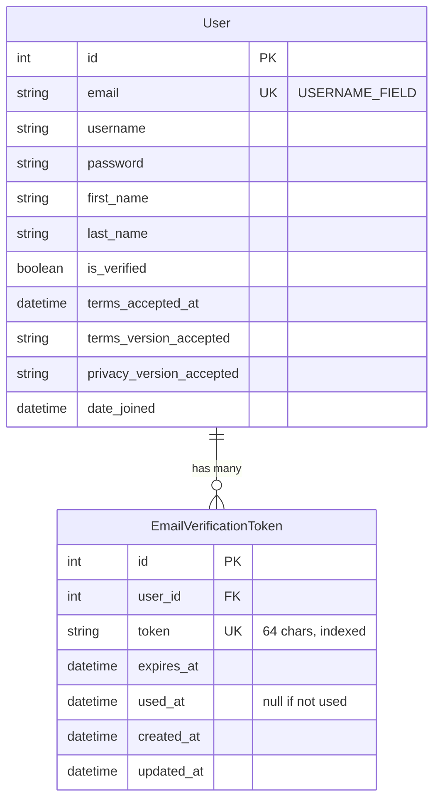
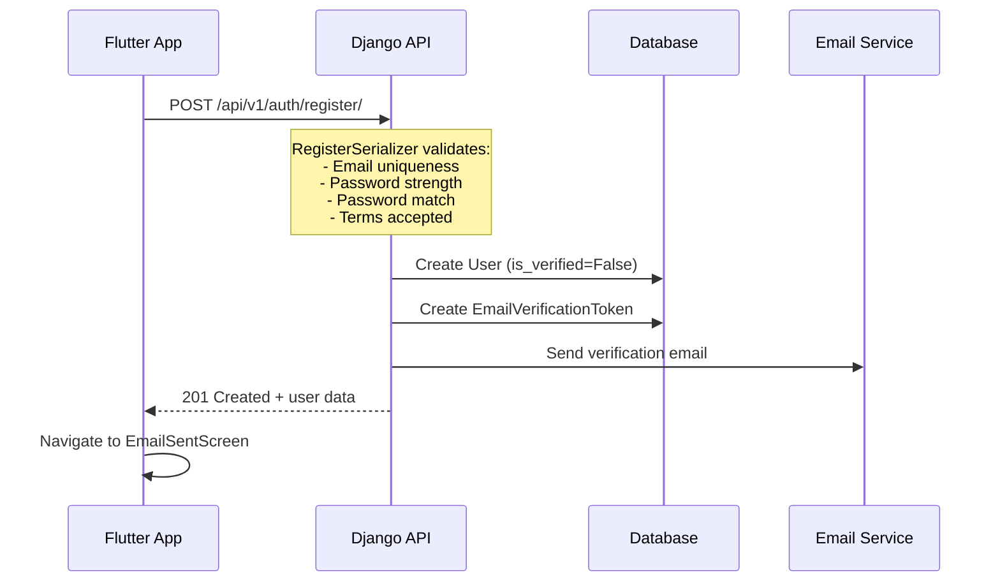
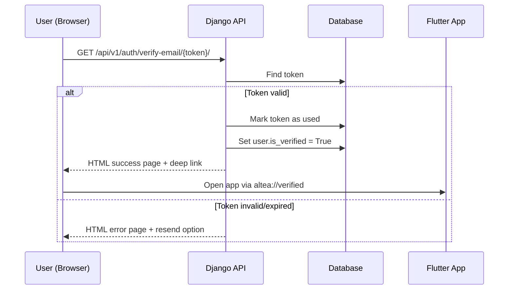
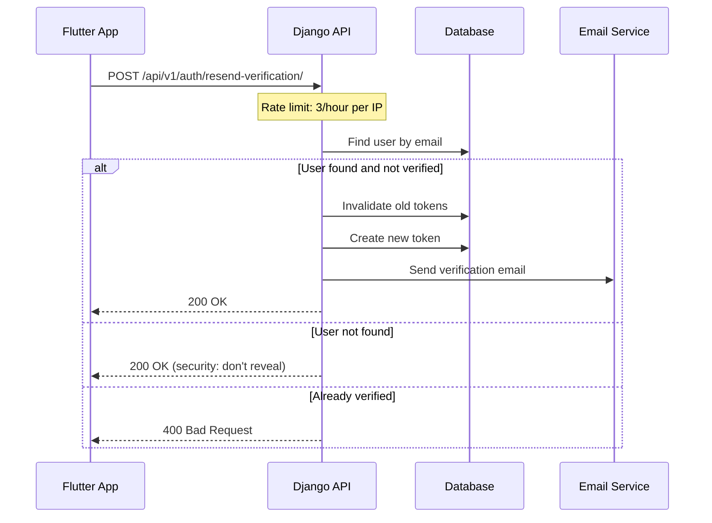

# User Registration

## Overview

### What This Feature Solves
User Registration provides a secure way for new users to create accounts in the Altea mobile application. It implements a complete email verification flow ensuring that only users with valid email addresses can access the platform.

### Use Cases
1. **UC1: New User Registration** - A new user creates an account with email, password, and personal information
2. **UC2: Email Verification** - User verifies their email address via a link sent to their inbox
3. **UC3: Resend Verification** - User requests a new verification email if the original expired or was not received
4. **UC4: Duplicate Email Prevention** - System prevents registration with an already-used email address

### Where Used in System
- Flutter mobile app: Registration screen (`mobile/lib/presentation/screens/auth/registration_screen.dart`)
- Web email verification page: Browser-based verification flow
- Admin panel: User management with verification status

## Architecture

### Components

#### Django Apps
- **accounts** - Core authentication app containing User model, registration logic, and API endpoints
- **core** - Provides base models (TimeStampedModel) and utilities

#### Key Models

| Model | File | Purpose |
|-------|------|---------|
| `User` | `apps/accounts/models.py:14` | Extended Django AbstractUser with email as primary identifier |
| `EmailVerificationToken` | `apps/accounts/models.py:157` | Stores verification tokens with expiration |

#### Services

| Service | File | Methods |
|---------|------|---------|
| `RegistrationService` | `apps/accounts/services.py:19` | `register_user()` - Creates user and triggers verification |
| `EmailVerificationService` | `apps/accounts/services.py:73` | `create_token()`, `send_verification()`, `verify_token()`, `resend_verification()` |

#### API Endpoints

| Method | Endpoint | View | Purpose |
|--------|----------|------|---------|
| POST | `/api/v1/auth/register/` | `RegisterAPIView` | Create new user account |
| GET | `/api/v1/auth/verify-email/{token}/` | `VerifyEmailAPIView` | Verify email (returns HTML) |
| POST | `/api/v1/auth/resend-verification/` | `ResendVerificationAPIView` | Resend verification email |

### Data Model



## Flows

### Registration Flow



### Email Verification Flow



### Resend Verification Flow



## API Specification

### POST /api/v1/auth/register/

**Request:**
```json
{
    "email": "user@example.com",
    "password": "SecurePass123",
    "password_confirm": "SecurePass123",
    "first_name": "John",
    "last_name": "Doe",
    "terms_accepted": true
}
```

**Response 201:**
```json
{
    "error": false,
    "message": "Registration successful. Please check your email to verify your account.",
    "user": {
        "id": 1,
        "email": "user@example.com",
        "first_name": "John",
        "last_name": "Doe",
        "is_verified": false
    }
}
```

**Response 400 (Validation Error):**
```json
{
    "error": true,
    "message": "Validation failed",
    "details": {
        "email": ["A user with that email already exists."],
        "password": ["This password is too short. It must contain at least 8 characters."]
    }
}
```

**Response 429 (Rate Limited):**
```json
{
    "error": true,
    "message": "Request was throttled. Expected available in 3600 seconds."
}
```

### GET /api/v1/auth/verify-email/{token}/

**Returns HTML page with:**
- Success state: "Email verified successfully!" + "Open Altea App" button
- Error states: Invalid token, Expired token, Already used token
- Deep link: `altea://verified`

### POST /api/v1/auth/resend-verification/

**Request:**
```json
{
    "email": "user@example.com"
}
```

**Response 200:**
```json
{
    "error": false,
    "message": "Verification email sent. Please check your inbox."
}
```

## Security

### Rate Limiting
- Registration: 5 requests/hour per IP (`RegistrationThrottle`)
- Resend verification: 3 requests/hour per IP (`ResendVerificationThrottle`)

### Password Validation
Uses Django's built-in validators:
1. `UserAttributeSimilarityValidator` - Password can't be similar to user attributes
2. `MinimumLengthValidator` - Minimum 8 characters
3. `CommonPasswordValidator` - Can't be a common password
4. `NumericPasswordValidator` - Can't be entirely numeric

### Token Security
- 64-character URL-safe token (`secrets.token_urlsafe(32)`)
- 24-hour expiration (configurable via `EMAIL_VERIFICATION_TOKEN_EXPIRY_HOURS`)
- Single-use (marked with `used_at` timestamp)
- Old tokens invalidated when new one is created

### GDPR Compliance
- `terms_accepted_at` stored for audit trail
- `terms_version_accepted` and `privacy_version_accepted` track consent versions
- Email verification required before account activation

## Configuration

### Settings (`config/settings/base.py`)

```python
# Email Configuration
EMAIL_BACKEND = 'django.core.mail.backends.console.EmailBackend'  # Dev
DEFAULT_FROM_EMAIL = 'Altea <noreply@altea.ch>'
EMAIL_VERIFICATION_TOKEN_EXPIRY_HOURS = 24

# REST Framework
REST_FRAMEWORK = {
    'DEFAULT_THROTTLE_RATES': {
        'registration': '5/hour',
        'resend_verification': '3/hour',
    }
}

# Site URL for email links
SITE_URL = 'http://localhost:8000'  # Configure for production
```

## File Structure

```
apps/accounts/
├── __init__.py
├── admin.py              # UserAdmin with verification badges
├── api/
│   ├── __init__.py
│   ├── serializers.py    # RegisterSerializer, UserSerializer
│   ├── throttling.py     # RegistrationThrottle, ResendVerificationThrottle
│   ├── urls.py           # API routes
│   └── views.py          # RegisterAPIView, VerifyEmailAPIView, ResendVerificationAPIView
├── models.py             # User, EmailVerificationToken
├── services.py           # RegistrationService, EmailVerificationService
├── templates/
│   └── accounts/
│       ├── emails/
│       │   └── verification_email.html
│       └── verify_email.html
└── tests/
    ├── test_api_registration.py  # 27 tests
    └── test_services.py          # 22 tests
```

## Testing

### Running Tests
```bash
# All registration tests
python manage.py test apps.accounts.tests

# Service tests only
python manage.py test apps.accounts.tests.test_services

# API tests only
python manage.py test apps.accounts.tests.test_api_registration
```

### Test Coverage
- 49 backend tests covering:
  - Successful registration
  - Validation errors (email, password, terms)
  - Email verification (valid, invalid, expired, used tokens)
  - Resend verification
  - Rate limiting configuration
  - Serializer validation

## Related Documentation

- [Legal Documents](./legal-documents.md) - Terms of Service and Privacy Policy
- API Documentation: `/api/docs/` (Swagger UI)
